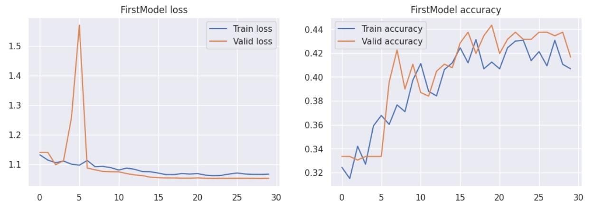

# Сверточная нейросеть для классификации котировок ценных бумаг - PatternCNN
Добро пожаловать на страничку проекта PatternCNN!  
## Введение
Я увлекаюсь анализом данных, машинным обучением, а также имею некоторый опыт торговли ценными бумагами на бирже. Мне хотелось реализовать собственный
pet-проект на стыке данных областей.  

Это экспериментальный проект по поиску (~~внеземной жизни / иголки в стоге сена~~) закономерностей и классификации изображений на основе биржевых 
котировок. Сравнение выбрано не случайно – т.к. поиск закономерностей в биржевых данных задача очень сложная и ожидать высоких результатов от 
«прямого» применения «высоких технологий» было бы слишком самонадеянно.  

Для данного проекта в качестве подопытного выбран SBER, год 2020, таим фрейм 1 минута. Выбор случайный, можно любой другой, но данный проект 
адаптирован под этот выбор и результаты на других данных, очевидно, могут отличаться.  
## Описание / Логика проекта.  
**Краткий пайплайн**: Скачиваем данные с MOEX --> Размечаем данные --> Рисуем картинки на основе разметки --> Учим нейросеть на полученных изображениях.  

Работаем с тайм фреймом 1 минута. Прогнозируем/классифицируем будущий 15-минутный интервал.  

Для текущей 15-минутки строим такое «окно»: наша 15-минутка «+» 45 минут до нее. Т.о. получаем «окно» размером 60 минут – **это наш паттерн**.  
Далее, по определенной логике оцениваем следующий 15 минутный интервал:  
- Если закрытие следующей 15-мин свечи выше текущей на определенное значение и не было значимых движений вниз, то присваиваем нашему окну класс 1 –
ожидаем уверенный рост.
- Если закрытие следующей 15-мин свечи ниже текущей на определенное значение и не было значимых движений вверх, то присваиваем нашему окну класс 3 –
ожидаем уверенное падение.
- В остальных случаях присваиваем нашему окну класс 2 - "торговый шум".

Разметив соответствующим образом датасет, рисуем картинки для наших «окон-паттернов» и сохраняем их в папки для соответствующих классов.  

  *Пример картинки - график цены закрытия и индикатор Болинджера* 

Далее скармливаем эти картинки нейросети в надежде, что всевидящее компьютерное око узреет невидимые человеческому глазу закономерности и сможет на 
приемлемом уровне классифицировать паттерны (а заодно сделает нас богатыми, но это не точно..)).  
## Описание файлов проекта.
Всего в репозитории представлены:  
**3 основных jupyter notebook файла**, в которых пошагово реализуем данный проект:  
  1) Get_and_prepare – тут мы получаем исторические данные по котировкам SBER за 2020 год, тайм фрейм 1 минута. «Причесываем» эти данные, добавляем доп информацию - индикаторы (скользящее среднее, индикатор Болинджера). Размечаем датасет на классы.
  2) Pic_and_split – тут, в соответствии с разметкой рисуем картинки и сохраняем по нужным папкам. Кроме того разбиваем картинки на тренировочную, валидационную и тестовую выборки.
  3) PatternCNN_colab – тут, используя возможности Google Colab, проводим непосредственно обучение на наших картинках 2-х моделей сверточных нейросетей. Одну напишем сами, для другой реализуем transfer learning.

**3 csv файла**:
  1) 2020_SBER - сырые данные -  загруженная история котировок.
  2) temp – просто файл для временного сохранения результатов.
  3) df_class – размеченный готовый датасет в виде таблички.

**2 папки с нарисованными картинками**:  
  1) All_pic – сюда, в подкаталоги (1, 2, 3) складываем все нарисованные картинки в зависимости от класса.
  2) Pic_for_CNN – полностью готовый датасет из картинок. Разделен на подкаталоги train, validation, test.
## Результаты и выводы  
В результате обучения моделей получили validation accuracy на уровне 40 – 45 % в зависимости от благосклонности рандома для всего процесса реализации проекта (от отбора картинок до обучения сети).  
  

Такой результат примерно на 10% отличается от случайного (33% для 3-х классов) результата. Это обусловлено природой биржевых данных и подавляющим превосходством случайности над закономерностями. Если бы мы решали задачу классификации, например, собачек и котиков, то любая, даже самая «простая» нейросеть, скажем, обученная на ImageNet-1K легко бы справилась с такой задачей. Т.к. собачки и котики имеют свои собственные паттерны, которые нейросеть понимает и легко различает. Но, когда речь идет о биржевых котировках все резко меняется. Паттерны, которые мы получаем на картинках, в подавляющем большинстве случаев не являются уникальными и принадлежащими определенному классу. Зачастую они лишь продукт случайности. Так, например, если разметить датасет всего на 2 класса (1 – ожидаем рост, 2 – ожидаем падение) получим результат accuracy на уровне 50% (при условии равенства классов) - т.е. абсолютно случайный результат. Оно и понятно – большую часть времени на бирже царит случайность.  

В данном проекте, в качестве одного из вариантов преодолеть «барьер случайности» было решение разделить выборку на 3 класса. Где на класс 2 и было возложено абсорбировать в себе «торговый шум». Это не идеальное решение и не единственно возможное, но в рамках данного проекта вполне приемлемое. При этом получался сильный дисбаланс классов с подавляющим превосходством класса 2 над остальными. Проблема дисбаланса решалась случайным отбором картинок для обучения сети по уровню наименее представленного класса.  

Учитывая вышесказанное, к результатам работы нейросети тут не может быть никаких претензий. Т.о. ключевым фактором для подобного рода проектов является сам набор данных и подготовка датасета.

