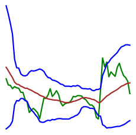

# Сверточная нейросеть для классификации котировок ценных бумаг - PatternCNN
Добро пожаловать на страничку проекта PatternCNN!  
## Введение
Я увлекаюсь анализом данных, машинным обучением, а также имею некоторый опыт торговли ценными бумагами на бирже. Мне хотелось реализовать собственный
pet-проект на стыке данных областей.  

Это экспериментальный проект по поиску (~~внеземной жизни / иголки в стоге сена~~) закономерностей и классификации изображений на основе биржевых 
котировок. Сравнение выбрано не случайно – т.к. поиск закономерностей в биржевых данных задача очень сложная и ожидать высоких результатов от 
«прямого» применения «высоких технологий» было бы слишком самонадеянно.  

Для данного проекта в качестве подопытного выбран SBER, год 2020, таим фрейм 1 минута. Выбор случайный, можно любой другой, но данный проект 
адаптирован под этот выбор и результаты на других данных, очевидно, могут отличаться.  
## Описание / Логика проекта.  
Краткий пайплайн: Скачиваем данные с MOEX --> Размечаем данные --> Рисуем картинки на основе разметки --> Учим нейросеть на полученных изображениях.  

Работаем с тайм фреймом 1 минута. Прогнозируем/классифицируем будущий 15-минутный интервал.  

Для текущей 15-минутки строим такое «окно»: наша 15-минутка «+» 45 минут до нее. Т.о. получаем «окно» размером 60 минут – **это наш паттерн**.  
Далее, по определенной логике оцениваем следующий 15 минутный интервал:  
- Если закрытие следующей 15-мин свечи выше текущей на определенное значение и не было значимых движений вниз, то присваиваем нашему окну класс 1 –
ожидаем уверенный рост.
- Если закрытие следующей 15-мин свечи ниже текущей на определенное значение и не было значимых движений вверх, то присваиваем нашему окну класс 3 –
ожидаем уверенное падение.
- В остальных случаях присваиваем нашему окну класс 2 - "торговый шум".

Разметив соответствующим образом датасет, рисуем картинки для наших «окон-паттернов» и сохраняем их в папки для соответствующих классов.  

  

Далее скармливаем эти картинки нейросети в надежде, что всевидящее компьютерное око узреет невидимые человеческому глазу закономерности и сможет на 
приемлемом уровне классифицировать паттерны (а заодно сделает нас богатыми, но это не точно..)). 

